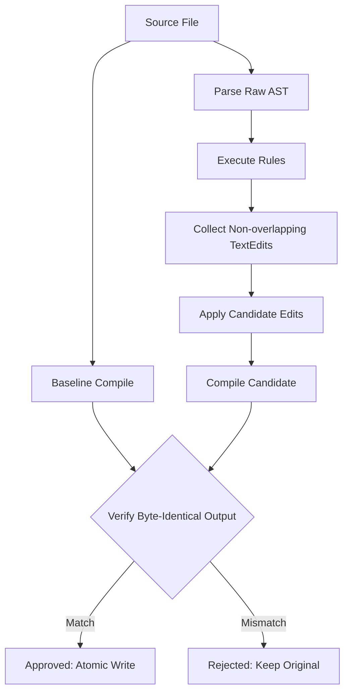

# civet-clint

[](https://github.com/shogi-dojo/civet-clint/actions/workflows/ci.yml)
[](https://opensource.org/licenses/MIT)

**civet-clint** is a high-performance, compiler-backed style linter and safe autofixer for [Civet](https://civet.dev).

Unlike regex-based formatters or approximate AST replacers, `civet-clint` uses the official `@danielx/civet` compiler parser and validates every single autofix by re-compiling the transformed code. If the emitted output diverges by even a single byte from the original compiled code, the fix is immediately rejected, guaranteeing **100% semantic safety and zero runtime regression**.

---

## Features

- 🛡️ **Compiler-Equivalence Verification**: Every autofix is verified against Civet's compilation output. Unsafe or output-altering fixes are automatically discarded.
- ⚡ **Atomic File Rewrites**: Changes are written atomically via tempfiles, avoiding partial writes, corruption, and preserving line endings (`\n` vs `\r\n`).
- 🎯 **Coffee React Style Rules**: Idiomatic rules designed for modern Civet codebases using CoffeeScript and React syntax styles.
- ⚙️ **Configurable & Extensible**: Support for presets (`coffee-react`), granular rule severities (`off`, `warn`, `error`), and integration with project `civet.json` configs.
- 📊 **Flexible CLI**: Rich terminal diagnostics, `--check` exit codes for CI, `--write` in-place fixing, and machine-readable `--format json`.

---

## Installation

```bash
# Local project dependency
npm install --save-dev civet-clint

# Or global CLI
npm install -g civet-clint
```

---

## CLI Usage

```bash
# Check all .civet files in the current workspace
civet-clint --check

# Check specific files or folders
civet-clint src/ components/ app.civet

# Automatically fix all safe style violations in place
civet-clint --write

# Specify custom configuration file
civet-clint --write --config ./civet-clint.config.json

# Output diagnostics in JSON for CI/CD pipelines
civet-clint --check --format json
```

### CLI Flags

| Flag | Description |
|---|---|
| `--check` | Lint files and report diagnostics. Exits with code `1` if errors are found, `0` if clean. (Default) |
| `-w`, `--write`, `--fix` | Apply autofixes to source files in place after verifying compiler equivalence. |
| `-c`, `--config <path>` | Path to a `civet-clint.config.json` configuration file. |
| `-f`, `--format <text\|json>` | Output format: human-readable `text` (default) or `json`. |
| `-v`, `--version` | Print `civet-clint` version and exit. |
| `-h`, `--help` | Show CLI usage help. |

---

## Configuration

Create a `civet-clint.config.json` file in your repository root:

```json
{
  "preset": "coffee-react",
  "civetConfig": "./civet.json",
  "rules": {
    "style/prefer-word-operators": "error",
    "style/prefer-concise-arrow": "error",
    "style/prefer-jsx-shorthand": "error",
    "style/no-null-equality": "warn",
    "style/no-is-not": "warn",
    "style/no-mixed-interpolation": "warn"
  }
}
```

### Presets

#### `coffee-react`
Configured specifically for idiomatic Civet + React codebases:
- `style/prefer-word-operators`: `"error"` (fixable)
- `style/prefer-concise-arrow`: `"error"` (fixable)
- `style/prefer-jsx-shorthand`: `"error"` (fixable)
- `style/no-null-equality`: `"warn"` (diagnostic)
- `style/no-is-not`: `"warn"` (diagnostic)
- `style/no-mixed-interpolation`: `"warn"` (diagnostic)
- Civet compiler options: `{ "coffeeIsnt": true, "react": true }`

---

## Rules Catalog

### Fixable Rules

#### `style/prefer-word-operators`
Replaces standard JavaScript operators with concise Civet word operators:
- `===` $\to$ `is`
- `!==` $\to$ `isnt`
- `&&` $\to$ `and`
- `||` $\to$ `or`
- `!flag` $\to$ `not flag`

> **Safety**: Comparisons against `null` or `undefined` (e.g. `x === null`) are safely excluded to prevent unintended semantics changes.

#### `style/prefer-concise-arrow`
Converts parameterless arrow functions to concise Civet arrow syntax:
- `() => 42` $\to$ `=> 42`
- `async () => 42` $\to$ `async => 42`
- `items.map(() => 0)` $\to$ `items.map(=> 0)`
- `<button onClick={() => doSomething()} />` $\to$ `<button onClick={=> doSomething()} />`

#### `style/prefer-jsx-shorthand`
Converts static `className` and `id` attributes into clean JSX tag shorthands:
- `<div className="btn primary" id="main">` $\to$ `<div .btn.primary #main>`
- `<Button className="primary" id="btn1" />` $\to$ `<Button .primary #btn1 />`

> **Safety**: Dynamic expressions (e.g. `className={clsx(...)}`), template strings, and invalid CSS identifiers are preserved unchanged.

---

### Diagnostic Rules

#### `style/no-null-equality`
Flags direct comparisons with `null` (`=== null`, `!== null`, `== null`, `is null`, `isnt null`), recommending explicit checks or existential operators.

#### `style/no-is-not`
Flags the use of `is not` (preferring `isnt`).

#### `style/no-mixed-interpolation`
Flags `${...}` string interpolations inside double quotes and mixed interpolation styles in the same file, recommending consistent CoffeeScript style `#{...}`.

---

## Programmatic API

You can also use `civet-clint` as a library:

```typescript
import { lintSource, lintFile, loadConfig } from 'civet-clint';

const config = loadConfig();
const result = lintSource('fn := () => a === b', {
  config,
  fix: true
});

console.log(result.isEquivalencePreserved); // true
console.log(result.fixedSource);            // "fn := => a is b"
```

---

## Architecture & Equivalence Engine



---

## License

MIT © shogi-dojo
