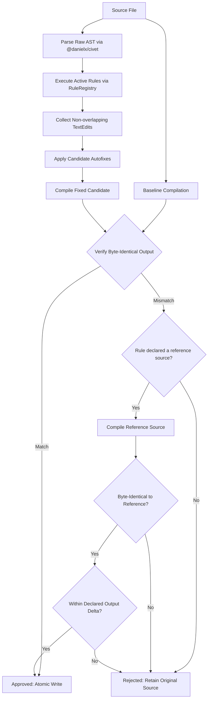

<p align="center">
  
</p>

# civet-clint

[](https://github.com/shogi-dojo/civet-clint/actions/workflows/ci.yml)
[](https://www.npmjs.com/package/civet-clint)
[](https://opensource.org/licenses/MIT)

**civet-clint** is a compiler-backed style checker and autofixer for [Civet](https://civet.dev). The package installs the concise `clint` command line tool and provides a programmatic Node.js API.

Unlike a text-only regex formatter, `civet-clint` uses the official `@danielx/civet` compiler parser. By default, every autofix edit is compiled and verified to produce byte-for-byte identical output to the original source. For opt-in non-byte-identical transforms (such as unquoting single-quoted module paths in `style/prefer-terse-imports`), fixes are validated against a compiler reference source and bounded by engine-enforced output delta checks. Unsafe or semantics-altering edits are rejected by the safety gate.

> **Release Status:** `0.7.0` published on npm `latest`. The tool targets `@danielx/civet` 0.11.15. As a pre-1.0 tool relying on Civet's parser and dialect options, compatibility is pinned to this compiler release. See the [Compatibility Matrix](https://github.com/shogi-dojo/civet-clint/blob/main/docs/compatibility.md).

---

## Features

- 🛡️ **Compiler-Equivalence Verification**: Every rule batch is verified against Civet's compilation output. Unsafe or output-altering edits are rejected by the safety gate.
- ⚡ **Atomic File Rewrites**: Changes are written atomically via temporary files, preventing partial writes and preserving line endings (`\n` vs `\r\n`).
- 🎯 **Bidirectional Civet Style Rules**: 42 built-in rules covering idiomatic Civet style, Coffee/React conventions, and compiler-safe migration toward standard Civet.
- 🧩 **Modular Rule Registry & Plugins**: Modular `RuleRegistry` abstraction with plugin contracts, duplicate-rule validation, and runtime-isolated registries.
- 🗂️ **Per-File Configuration Overrides**: Support for glob-based `overrides` in configuration files to tailor rules, presets, and compiler dials per directory or file pattern.
- ⚙️ **Configurable & Extensible**: Support for presets (`default`, `civet-idiomatic`, `coffee-react`, `coffee-to-standard`), granular rule severities (`off`, `warn`, `error`), and integration with project `civet.json` configs.
- 🧭 **Dial-Aware Capability Checks**: Rules declare the compiler options they require (e.g., `autoLet`, `react`, `coffeeRange`). Incompatible rules are skipped rather than emitting invalid autofixes.
- 📊 **Flexible CLI**: Rich terminal diagnostics, `--check` exit codes for CI, `--write` in-place fixing, machine-readable `--format json`, parallel linting via `--concurrency`, and `clint --print-config [file]` for inspecting workspace and per-file resolved configurations.

---

## Installation

```bash
npm install --save-dev civet-clint

# Or with yarn
yarn add -D civet-clint

# Or with pnpm
pnpm add -D civet-clint
```

---

## CLI Usage

```bash
# Check all .civet files in the current workspace (default: --check)
npx clint

# Check specific files or folders
npx clint src/ components/ app.civet

# Automatically fix all safe style violations in place
npx clint --write

# Specify custom configuration file
npx clint --write --config ./config/clint.json

# Output diagnostics in JSON format for CI/CD pipelines
npx clint --check --format json

# Print resolved workspace configuration and compiler dial
npx clint --print-config

# Print effective resolved configuration for a specific file (including overrides)
npx clint --print-config src/components/Button.civet
```

### CLI Flags

| Flag | Description |
|---|---|
| `--check` | Lint files and report diagnostics. Exits with code `1` if errors are found, `0` if clean. (Default) |
| `-w`, `--write`, `--fix` | Apply autofixes to source files in place after verifying compiler equivalence. |
| `--rewrite` | Rename and convert JS/TS files (`.js`, `.jsx`, `.ts`, `.tsx`, `.mts`, `.cts`) to `.civet` after verifying they parse, then run the autofix pipeline in place. |
| `--print-config [file]` | Print the resolved preset, compiler options, rules, and skipped/incompatible rules as JSON, then exit. If a target file is passed, resolves matching per-file overrides. |
| `-j, --concurrency <n>` | Number of worker threads used to lint files in parallel. Defaults to the CPU count; `1` lints sequentially in the main process. Results are always reported in sorted file order regardless of this value. |
| `--verbose` | Print the resolved config path, Civet compiler-options path, active preset, compiler options in effect, matching overrides, and file count to stderr before linting. Leaves `--format json` parseable on stdout. |
| `-c`, `--config <path>` | Path to a configuration file. Only needed for names outside the auto-discovered list. |
| `-f`, `--format <text\|json>` | Output format: human-readable `text` (default) or `json`. |
| `-v`, `--version` | Print `clint` version and exit. |
| `-h`, `--help` | Show CLI usage help. |

---

## Configuration

Create a config file in your repository root. These names are discovered
automatically, in order: `clint.config.json`, `.clintrc.json`, `.clint.json`. Any
other filename works too, but must be passed explicitly with `--config`.

```json
{
  "preset": "coffee-react",
  "civetConfig": "./civet.json",
  "rules": {
    "style/prefer-word-operators": "error",
    "style/prefer-concise-arrow": "error",
    "style/prefer-bare-assignment": "error",
    "style/no-null-equality": "warn",
    "style/no-is-not": "warn",
    "style/no-trailing-semicolons": "error"
  },
  "overrides": [
    {
      "files": ["test/**/*.civet", "**/*.test.civet"],
      "rules": {
        "style/prefer-word-operators": "off"
      }
    },
    {
      "files": ["src/legacy/**/*.civet"],
      "civetOptions": {
        "coffeeEq": true
      }
    }
  ]
}
```

### Rule Options

A rule entry is normally a bare level (`"error"`). Rules that accept options also
support the array form `[level, options]`:

```json
{
  "rules": {
    "style/prefer-terse-imports": ["error", { "unquoteSingleQuotes": true }]
  }
}
```

Options are validated when the config loads: an unknown option key, a value of the
wrong type, or options given to a rule that declares none is a hard error rather than
a silently ignored setting. `clint --print-config` prints the effective options for
every active rule, including defaults you did not set. Overrides accept the same array
form, so options can be scoped to a glob.

#### `style/prefer-terse-imports`

| Option | Type | Default | Description |
|---|---|---|---|
| `unquoteSingleQuotes` | boolean | `false` | Also unquote single-quoted module specifiers. |
| `extraZeroArgCallees` | string[] | `[]` | For `style/no-single-param-arrow-without-parens`: project-local callees whose callback takes no arguments, exempted from the ambiguity warning. |

By default the rule only unquotes double-quoted specifiers, because that rewrite is
byte-identical: Civet echoes the original quote character, and the terse form emits
double quotes. Unquoting `'./x'` therefore changes the emitted literal to `"./x"` —
a quote-style change, but still a change, so it stays opt-in.

When enabled, these fixes are **not** validated against the original compiled output.
Two checks replace that one, and a fix must pass both:

1. **Reference source.** The rule hands the engine the original file with exactly
   those specifiers rewritten to double quotes, and nothing else. The engine compiles
   it and requires the fixed file's output to match byte-for-byte. Because the rewrite
   is driven by parser-identified specifier spans rather than text matching, a string
   that merely looks like a path (`x := 'plain from ./str'`) is never touched.
2. **Output-delta bound.** The rule also declares *how* its output may differ — here,
   `quote-style`. The engine independently verifies that the two compiled outputs are
   identical once string-literal quoting is normalized, so the change is provably
   confined to quote characters and cannot alter identifiers, structure, or string
   contents.

The second check is what makes the first safe to trust. A reference source is supplied
by the rule, so on its own it would let a rule authorize its own rewrite; the
engine-owned delta bound is not something a rule can widen. The strict byte-identity
check is unchanged for every other rule and for this rule's default path.

### Presets

#### `default`
The baseline neutral preset that relies on Civet's standard word-operator parsing without enforcing specific framework or dialect styles:
- `style/prefer-word-operators`: `"error"` (fixable)
- `style/prefer-concise-arrow`: `"error"` (fixable)
- `style/no-mixed-interpolation`: `"warn"` (diagnostic)
- `style/no-trailing-semicolons`: `"error"` (fixable)
- Compiler options: `{}`

#### `civet-idiomatic`
Comprehensive preset enforcing standard, modern Civet idioms (derived from Erik Demaine's official Civet style guide) without legacy CoffeeScript options:
- `style/prefer-word-operators`: `"error"` (fixable)
- `style/prefer-concise-arrow`: `"error"` (fixable)
- `style/prefer-walrus-declarations`: `"error"` (fixable)
- `style/prefer-terse-imports`: `"error"` (fixable)
- `style/no-trailing-commas`: `"error"` (fixable)
- `style/prefer-indented-object`: `"error"` (fixable)
- `style/prefer-indented-blocks`: `"error"` (fixable)
- `style/no-trailing-semicolons`: `"error"` (fixable)
- `style/prefer-implicit-block-call`: `"error"` (fixable)
- `style/prefer-implicit-call-args`: `"error"` (fixable)
- `style/prefer-implicit-arrow-arg`: `"error"` (fixable)
- `style/prefer-jsx-shorthand`: `"error"` (fixable, requires `react`)
- `style/prefer-bare-jsx-values`: `"error"` (fixable, requires `react`)
- `style/prefer-unclosed-jsx`: `"error"` (fixable, requires `react`)
- `style/prefer-unless`: `"error"` (fixable)
- `style/prefer-at-shorthand`: `"error"` (fixable)
- `style/prefer-length-shorthand`: `"error"` (fixable, forbids `coffeeComment`)
- `style/prefer-typeof-shorthand`: `"error"` (fixable)
- `style/prefer-property-shorthand`: `"error"` (fixable)
- `style/prefer-bare-for`: `"error"` (fixable)
- `style/prefer-bare-conditions`: `"error"` (fixable)
- `style/prefer-existential-check`: `"warn"` (fixable)
- `style/prefer-optional-type`: `"warn"` (diagnostic)
- `style/prefer-postfix-conditional`: `"warn"` (diagnostic)
- `style/prefer-ampersand-shorthand`: `"warn"` (diagnostic)
- `style/prefer-jsx-attr-shorthand`: `"warn"` (diagnostic, requires `react`)
- Compiler options: `{ "react": true }`

#### `coffee-react`
Tailored for idiomatic Civet + React codebases:
- `style/prefer-word-operators`: `"error"` (fixable)
- `style/prefer-concise-arrow`: `"error"` (fixable)
- `style/prefer-jsx-shorthand`: `"error"` (fixable, requires `react`)
- `style/prefer-bare-assignment`: `"error"` (fixable, requires `autoLet`)
- `style/prefer-terse-imports`: `"error"` (fixable)
- `style/prefer-bare-jsx-values`: `"error"` (fixable, requires `react`)
- `style/prefer-hash-comments`: `"error"` (fixable, requires `coffeeComment`)
- `style/no-trailing-semicolons`: `"error"` (fixable)
- `style/prefer-existential-check`: `"warn"` (diagnostic)
- `style/prefer-jsx-attr-shorthand`: `"warn"` (diagnostic, requires `react`)
- `style/prefer-ampersand-shorthand`: `"warn"` (diagnostic)
- `style/no-single-param-arrow-without-parens`: `"warn"` (diagnostic)
- `style/prefer-named-export-default`: `"warn"` (diagnostic)
- `style/no-thin-arrow`: `"warn"` (diagnostic)
- `style/no-pipe-operator`: `"error"` (diagnostic)
- `style/prefer-range-operator`: `"warn"` (diagnostic, requires `coffeeRange`)
- `style/no-null-equality`: `"warn"` (diagnostic)
- `style/no-is-not`: `"warn"` (diagnostic)
- `style/no-mixed-interpolation`: `"warn"` (diagnostic)
- Compiler options: `{ "autoLet": true, "coffeeComment": true, "coffeeIsnt": true, "coffeeRange": true, "react": true }`

#### `coffee-to-standard`

A transition preset for legacy CoffeeScript-compatible source. It parses with the
same compiler options as `coffee-react`, but enables the safe inverse rules instead
of their Coffee-style counterparts:

- `style/prefer-slash-comments`: `"error"` (`#` → `//`)
- `style/prefer-is-not`: `"error"` (`isnt` → `is not`)
- `style/prefer-explicit-declarations`: `"error"` (`:=` and exported auto-bindings)
- The three dialect-independent `default` rules remain enabled. The existing
  word-operator rule stays out because it selects `isnt` while `coffeeIsnt` is active;
  the transition preset must converge directly on `is not`.
- Compiler options: `{ "autoLet": true, "coffeeComment": true, "coffeeIsnt": true, "coffeeRange": true, "react": true }`

Use it as a staged migration rather than turning compiler options off immediately:

1. Select `"preset": "coffee-to-standard"` while keeping the existing Civet dial.
2. Run `clint --print-config` and inspect `skippedRules`. In particular,
   `style/prefer-is-not` is skipped while `coffeeNot` is enabled because that option
   changes the meaning of `is not`.
3. Disable `coffeeNot` only after compiling/testing the project without it, then run
   `clint --write`, review the diff, and run it again to verify a no-op.
4. Repeat until `clint --check` is clean; unsupported cases remain untouched.
5. Disable migrated Coffee options in `civet.json` and switch to `"preset": "default"`.
6. Compile and test the application after each compiler-option removal.

Opposing rules cannot be enabled together. Clint rejects those configurations before
linting, preventing repeated autofix runs from oscillating between styles.

### Per-file Configuration Overrides

The `overrides` array allows configuring rules, presets, compiler options, or separate `civet.json` configurations for subsets of files matching glob patterns. Overrides apply in declaration order on top of the base configuration.

```json
{
  "overrides": [
    {
      "files": "src/components/**/*.civet",
      "civetOptions": { "react": true },
      "rules": {
        "style/prefer-jsx-shorthand": "error",
        "style/prefer-jsx-attr-shorthand": "error"
      }
    }
  ]
}
```

### Compiler Dial & Rule Capabilities

Rules declare required compiler options (e.g., `autoLet`, `react`, `coffeeRange`) via `meta.capabilities`. When the active dial does not enable a rule's requirements, the rule is **automatically skipped** rather than executing and emitting diagnostics or fixes that are invalid under the active dial.

---

## Rules Catalog

`civet-clint` currently provides 42 built-in style, correctness, and migration rules.

### Fixable Rules

| Rule ID | Description | Required Dial |
|---|---|---|
| [`style/prefer-word-operators`](https://github.com/shogi-dojo/civet-clint/blob/main/src/rules/prefer-word-operators.civet) | Convert `===`, `!==`, `&&`, `||`, `!` to `is`, `isnt`, `and`, `or`, `not`. | — |
| [`style/prefer-concise-arrow`](https://github.com/shogi-dojo/civet-clint/blob/main/src/rules/prefer-concise-arrow.civet) | Convert parameterless `() =>` to concise `=>`. | — |
| [`style/no-trailing-semicolons`](https://github.com/shogi-dojo/civet-clint/blob/main/src/rules/no-trailing-semicolons.civet) | **Phase `cleanup`.** Disallow unnecessary trailing semicolons at statement ends. Keeps any semicolon that suppresses an implicit return — see below. Verified via `semicolon-style` output delta. | — |
| [`style/prefer-jsx-shorthand`](https://github.com/shogi-dojo/civet-clint/blob/main/src/rules/prefer-jsx-shorthand.civet) | Convert `className="btn"` and `id="main"` to `.btn` and `#main` shorthands. Only where the shorthand lowers in place — see below. | `react` |
| [`style/prefer-bare-assignment`](https://github.com/shogi-dojo/civet-clint/blob/main/src/rules/prefer-bare-assignment.civet) | Prefer bare `x = 1` for `let` and `:=` for `CONST_CASE` bindings. | `autoLet` |
| [`style/prefer-walrus-declarations`](https://github.com/shogi-dojo/civet-clint/blob/main/src/rules/prefer-walrus-declarations.civet) | Convert `const x = …` to `x := …` and `let x = …` to `x .= …`, including destructuring patterns. Byte-identical output. Conflicts with `prefer-bare-assignment`. | — |
| [`style/prefer-existential-check`](https://github.com/shogi-dojo/civet-clint/blob/main/src/rules/prefer-existential-check.civet) | Convert `x != null`, `null != x`, `x !== undefined` to `x?`, and `x == null`, `x === undefined` to `not x?`. | — |
| [`style/prefer-unless`](https://github.com/shogi-dojo/civet-clint/blob/main/src/rules/prefer-unless.civet) | Convert `if not a` and `if (!a)` to `unless a`. Bails on binary expressions and existential negations to guard operator precedence. | — |
| [`style/prefer-at-shorthand`](https://github.com/shogi-dojo/civet-clint/blob/main/src/rules/prefer-at-shorthand.civet) | Convert `this.x`, `this?.x`, `this[k]`, `this.#p`, and `this` to `@x`, `@?.x`, `@[k]`, `@#p`, and `@`. | — |
| [`style/prefer-length-shorthand`](https://github.com/shogi-dojo/civet-clint/blob/main/src/rules/prefer-length-shorthand.civet) | Convert `arr.length` and `arr?.length` to `arr#` and `arr?#`. Skipped under `coffeeComment`, where `#` opens a line comment and `arr#` would truncate the line. | not `coffeeComment` |
| [`style/prefer-typeof-shorthand`](https://github.com/shogi-dojo/civet-clint/blob/main/src/rules/prefer-typeof-shorthand.civet) | Convert `typeof x is "type"` and `typeof x === "type"` to `x <? "type"`. | — |
| [`style/prefer-property-shorthand`](https://github.com/shogi-dojo/civet-clint/blob/main/src/rules/prefer-property-shorthand.civet) | Convert `{ b: a.b }` and `{ c: a.b.c }` to `{ a.b }` and `{ a.b.c }`. | — |
| [`style/prefer-implicit-return`](https://github.com/shogi-dojo/civet-clint/blob/main/src/rules/prefer-implicit-return.civet) | Drop explicit `return` at trailing position of functions, methods, and arrows. Bails on generators, object returns, loops, valueless `return`, and any `return` that is not textually last. **Not in any preset** — see below. | — |
| [`style/prefer-bare-for`](https://github.com/shogi-dojo/civet-clint/blob/main/src/rules/prefer-bare-for.civet) | Convert `for const x of xs` and `for (const x of xs)` to `for x of xs`. | — |
| [`style/prefer-bare-conditions`](https://github.com/shogi-dojo/civet-clint/blob/main/src/rules/prefer-bare-conditions.civet) | Omit outer parentheses around `if`, `unless`, `while`, and `switch` condition expressions. Verified via `whitespace-style` output delta. | — |
| [`style/prefer-implicit-block-call`](https://github.com/shogi-dojo/civet-clint/blob/main/src/rules/prefer-implicit-block-call.civet) | Drop the call parens on multi-line `describe`/`it`/`test` blocks and hooks so indentation closes them, removing stacked `)))` closers. | — |
| [`style/prefer-implicit-call-args`](https://github.com/shogi-dojo/civet-clint/blob/main/src/rules/prefer-implicit-call-args.civet) | Drop call parens on a trailing matcher (`expect(a).toBe 'x'`) or a `render(<JSX/>)` call, letting the argument list close the line. Single-line, statement-ending calls only; an empty argument list keeps its parens. | — |
| [`style/prefer-implicit-arrow-arg`](https://github.com/shogi-dojo/civet-clint/blob/main/src/rules/prefer-implicit-arrow-arg.civet) | Drop call parens when the sole argument is a zero-parameter arrow (`vi.fn => x`, `lazy => import(…)`). Never fires on an object property followed by more properties — the arrow would absorb them. | — |
| [`style/prefer-terse-imports`](https://github.com/shogi-dojo/civet-clint/blob/main/src/rules/prefer-terse-imports.civet) | Omit the optional `import` keyword and unquote safe module paths (`{ t } from ../i18n`). Accepts [`unquoteSingleQuotes`](#rule-options). | — |
| [`style/prefer-jsx-attr-shorthand`](https://github.com/shogi-dojo/civet-clint/blob/main/src/rules/prefer-jsx-attr-shorthand.civet) | Convert `prop={prop}` to `{prop}`. The `prop={true}` form is reported but not fixed — see below. | `react` |
| [`style/prefer-bare-jsx-values`](https://github.com/shogi-dojo/civet-clint/blob/main/src/rules/prefer-bare-jsx-values.civet) | Convert braced values `attr={value}` to bare values `attr=value` for identifiers, member expressions, and non-string literals. | `react` |
| [`style/prefer-unclosed-jsx`](https://github.com/shogi-dojo/civet-clint/blob/main/src/rules/prefer-unclosed-jsx.civet) | Drop a redundant closing tag (`<span>hi</span>` → `<span>hi`) and the `/` from a self-closing tag (`<Foo a=1 />` → `<Foo a=1>`), where indentation already delimits the element. `<pre>`/`<textarea>` keep their closers — see below. | `react` |
| [`style/prefer-hash-comments`](https://github.com/shogi-dojo/civet-clint/blob/main/src/rules/prefer-hash-comments.civet) | Convert `//` line comments to CoffeeScript `#` comments. | `coffeeComment` |
| [`style/prefer-slash-comments`](https://github.com/shogi-dojo/civet-clint/blob/main/src/rules/prefer-slash-comments.civet) | Convert CoffeeScript `#` comments to standard Civet `//` comments while preserving directives, shebangs, block comments, and JSX text. | `coffeeComment` |
| [`style/prefer-is-not`](https://github.com/shogi-dojo/civet-clint/blob/main/src/rules/prefer-is-not.civet) | Convert CoffeeScript `isnt` to standard Civet `is not`. | `coffeeIsnt` |
| [`style/prefer-explicit-declarations`](https://github.com/shogi-dojo/civet-clint/blob/main/src/rules/prefer-explicit-declarations.civet) | Convert `:=` and exported auto-bindings to explicit `const`/`let` declarations. Bare `autoLet` requires scope/hoisting analysis and remains untouched. | `autoLet` |
| [`style/no-trailing-commas`](https://github.com/shogi-dojo/civet-clint/blob/main/src/rules/no-trailing-commas.civet) | Remove a comma before a closing bracket, brace or paren — object literals, arrays, argument lists, destructuring patterns and import clauses. Never edits regex literals, array elisions, or a comma after a rest element. Verified via `trailing-comma-style` output delta. | — |
| [`style/prefer-indented-object`](https://github.com/shogi-dojo/civet-clint/blob/main/src/rules/prefer-indented-object.civet) | Drop the braces from a multi-line object literal bound to a declaration, letting indentation delimit it. | — |
| [`style/prefer-indented-blocks`](https://github.com/shogi-dojo/civet-clint/blob/main/src/rules/prefer-indented-blocks.civet) | Drop the braces and head parens from a JS-style statement block (`if` / `unless` / `for` / `while` / `switch` / `try` / `catch` / `finally`), letting indentation delimit the body. Handles a head that has already lost its parens (`if a {`) as well as `if (a) {`. Verified via `whitespace-style` output delta. Two shapes are reported without a fix — see below. | — |
| [`style/no-braced-arrow-body`](https://github.com/shogi-dojo/civet-clint/blob/main/src/rules/no-braced-arrow-body.civet) | **Phase `repair`.** De-brace a `=> { ... }` body that Civet parses as an object literal. Applied by `--rewrite`; not by `--write`. | — |
| [`style/no-discarded-arrow-return`](https://github.com/shogi-dojo/civet-clint/blob/main/src/rules/no-discarded-arrow-return.civet) | **Phase `repair`.** Remove a trailing `;` that collapses a concise arrow into a block discarding its return value. Applied by `--rewrite`; not by `--write`. | — |

#### `style/prefer-implicit-return` — why it is opt-in

The rule is correct for the shapes it handles, but Civet's implicit-return
semantics are subtle enough that it still proposes fixes the equivalence gate
rejects: 22 sites across a 441-file production codebase. A rejected fix surfaces
as a `compiler-equivalence-mismatch` error, so at `error` in a preset it would
make `clint --check` exit non-zero on style-guide-conformant code, on every run.

It is registered and fully supported — enable it explicitly:

```json
{ "rules": { "style/prefer-implicit-return": "error" } }
```

It will move into `civet-idiomatic` once that number is zero.

#### `style/prefer-indented-blocks` — the two shapes reported without a fix

Both are cases where the *before* side of the equivalence check is itself the bug,
so autofixing would be verifying a repair against broken output.

A **single-statement body ending in `;`** parses as an object with a method
definition — `if (a) { g(); }` becomes `if (a) ({ g() {; } })`, and `g()` never
runs.

A **block in expression position** (the last statement of a function) already
mis-parses into a returned object literal:

```civet
afterEach =>
  if (original) {
    Object.defineProperty(proto, 'scrollTo', original)
  } else {
    delete proto.scrollTo
  }
```

```js
// what Civet actually emits — both branches become returned objects
if (original) { return ({
  defineProperty: Object.defineProperty(proto, 'scrollTo', original)
})} else return ({ scrollTo: delete proto.scrollTo })
```

De-bracing *repairs* this, so the emitted output legitimately changes and the gate
correctly rejects the fix. Repair it by hand, adding a trailing `;` where the block
should return nothing.

Blocks nested inside a braced `=> { … }` arrow body are skipped entirely: de-bracing
the inner block while the arrow keeps its braces breaks compilation. Run
`style/no-braced-arrow-body` first, and this rule sees them on a later pass.

#### `style/prefer-jsx-attr-shorthand` — why only one of the two forms is fixed

`prop={prop}` → `{prop}` re-expands to exactly `prop={prop}`, including after a
`{...spread}`, so compiled output is unchanged and the fix is applied.

`prop={true}` → `prop` is **reported without a fix**. Civet emits the bare attribute
as `prop`, so the compiled output genuinely differs. React treats both as `true`, but
that is a render-equivalence claim, and the gate only accepts byte-identical output.
Note the two forms are not interchangeable in source either: a bare `prop` is the
*boolean* shorthand, so writing it in place of `prop={prop}` would change meaning.

#### `style/no-trailing-semicolons` — the semicolons it will not remove

In Civet a trailing `;` is not always cosmetic: inside a function body it is one of
the sanctioned ways to suppress the implicit return of the last statement.

```civet
useEffect =>
  setCount 5;        # without the `;` this becomes `return setCount(5)`, and React
                     # treats a non-function return value as a cleanup callback.
```

The rule verifies each candidate by compiling with and without the semicolon and
comparing normalized output, so it reports only removals that provably do not change
the emitted program. Candidates are bisected rather than tested one at a time, which
keeps a file with hundreds of semicolons to a handful of compiles.

Note this is the opposite of `style/no-discarded-arrow-return`, where the semicolon
*must* go. The two never overlap: that rule fires only when the body is not a real
block.

#### `style/prefer-jsx-shorthand` — what it will and won't rewrite

Civet lowers the `.class`/`#id` shorthand to the **front of the tag, on the tag-name
line**, wherever it was written. The rule therefore only rewrites attributes that are
already there — the leading run of `className`/`id` on the tag line:

```civet
<div className="a" id="b" onClick={f}>   ✅  → <div .a #b onClick={f}>
<div className="a" {...props}>           ✅  → <div .a {...props}>
<Icon size={16} className="i" />         ❌  would emit className before size
<div {...props} className="a">           ❌  would invert spread precedence
<button                                  ❌  would collapse the line break
  className="a"
>
```

The last two matter beyond formatting: moving `className` ahead of a `{...spread}`
changes which value wins. Skipped sites are still reported, so they surface for review.

#### `style/prefer-unclosed-jsx` — when a tag can stay open

Style-guide item 22 has two halves and this rule does both: drop a closing tag, and
drop the `/` from a self-closing one. They live in one rule because the engine's
combined-fix pass verifies a batch by re-deriving each rule's edits on the text the
*other* rules already changed — split in two, dropping a `</div>` moves what the
slash half sees on the next line, the replay stops matching, and the whole batch is
rejected. Use `closingTags` / `selfClosingSlash` to take only one half:

```json
{ "rules": { "style/prefer-unclosed-jsx": ["error", { "selfClosingSlash": false }] } }
```

Civet decides where an unclosed element ends from what *follows* it, so both halves
are guarded by the next non-blank line:

```civet
<div>
  <span>hi</span>      ✅  → <span>hi
  <Icon size=16 />     ✅  → <Icon size=16>
</div>

<span>a</span> tail          ❌  "tail" would become a child of the span
<div><Foo /><Bar /></div>    ❌  <Foo> would swallow <Bar/>
<pre>code</pre>              ❌  the guide's stated exception

<div .outer>
  <div .spot />              ❌  `</div>` would pair with <div .spot>, not <div .outer>
</div>

slot={cond ? null : (
  <Timer id=1 />             ❌  a `)` or `}` closer next stops the parse
)}
```

The `<div .spot />` case is the subtle one: it only bites when the tag name matches
the enclosing element's, so it shows up on HTML-cased tags and never on components.
`<pre>` and `<textarea>` are skipped on the guide's authority, not the compiler's —
the equivalence gate accepts dropping their closers, but re-emitting a closer on its
own line inside a whitespace-preserving element is not a change worth assuming away.

### Diagnostic Rules

| Rule ID | Description | Required Dial |
|---|---|---|
| [`style/prefer-optional-type`](https://github.com/shogi-dojo/civet-clint/blob/main/src/rules/prefer-optional-type.civet) | Prefer optional type shorthand `T?` over `T \| undefined` (autofix disabled: TypeScript emit wraps union types). | — |
| [`style/prefer-postfix-conditional`](https://github.com/shogi-dojo/civet-clint/blob/main/src/rules/prefer-postfix-conditional.civet) | Prefer postfix conditional `return if a` over one-liner `if (a) return` (autofix disabled: JS emit differs by block braces). | — |
| [`style/prefer-jsx-attr-shorthand`](https://github.com/shogi-dojo/civet-clint/blob/main/src/rules/prefer-jsx-attr-shorthand.civet) | Report `prop={true}`, which lowers to `prop` and so is not byte-identical. The fixable `prop={prop}` form is listed above. | `react` |
| [`style/prefer-ampersand-shorthand`](https://github.com/shogi-dojo/civet-clint/blob/main/src/rules/prefer-ampersand-shorthand.civet) | Prefer `&` block shorthand for single-parameter callbacks (`.map &.id`). | — |
| [`style/no-single-param-arrow-without-parens`](https://github.com/shogi-dojo/civet-clint/blob/main/src/rules/no-single-param-arrow-without-parens.civet) | Require parentheses around single arrow function parameters `(x) => ...`. | — |
| [`style/prefer-named-export-default`](https://github.com/shogi-dojo/civet-clint/blob/main/src/rules/prefer-named-export-default.civet) | Prefer named default exports (`export default MyComp = ...`). | — |
| [`style/no-thin-arrow`](https://github.com/shogi-dojo/civet-clint/blob/main/src/rules/no-thin-arrow.civet) | Disallow thin arrows `->` in favor of fat arrows `=>`. | — |
| [`style/no-pipe-operator`](https://github.com/shogi-dojo/civet-clint/blob/main/src/rules/no-pipe-operator.civet) | Disallow pipe operator `\|>`. | — |
| [`style/prefer-range-operator`](https://github.com/shogi-dojo/civet-clint/blob/main/src/rules/prefer-range-operator.civet) | Prefer `[0...N].map` range loops over `Array.from({ length: N }, ...)`. | `coffeeRange` |
| [`style/no-null-equality`](https://github.com/shogi-dojo/civet-clint/blob/main/src/rules/no-null-equality.civet) | Disallow direct comparisons with `null`. | — |
| [`style/no-is-not`](https://github.com/shogi-dojo/civet-clint/blob/main/src/rules/no-is-not.civet) | Disallow `is not` in favor of `isnt`. | `coffeeIsnt` or `coffeeNot` |
| [`style/no-mixed-interpolation`](https://github.com/shogi-dojo/civet-clint/blob/main/src/rules/no-mixed-interpolation.civet) | Disallow mixing `${...}` and `#{...}` within the same file. | — |

### Style-Guide Coverage

Clint automates the *mechanical* conventions of a Civet style guide — the ones with
a deterministic, compiler-verifiable rewrite. Several conventions are deliberately
out of scope; their absence is a design boundary, not a missing feature.

| Convention | Status | Notes |
|---|---|---|
| Word operators, existential checks, terse declarations/exports, terse imports, JSX shorthands, arrow style, range loops | **Automated** | See the rule tables above. |
| JSX class/id shorthand where the attribute is not already first on the tag line | Partially automated | The shorthand lowers to the front of the tag, so rewriting elsewhere reorders emitted attributes — or changes precedence against a `{...spread}`. Reported, not autofixed. |
| Side-effect import ordering | Not automated | Reordering imports can change evaluation order, so it is not compiler-equivalent. |
| Single-quoted module paths | Automated, opt-in | Off by default, because unquoting `'./x'` changes the emitted quote character. Set [`unquoteSingleQuotes`](#rule-options) on `style/prefer-terse-imports` to enable it; the fix is then verified against a reference compile so the change is provably confined to specifier quote style. |
| Removing unused or default `React` imports | Not automated | Requires whole-program binding analysis; deleting a binding is not an equivalence-preserving edit. |
| Comment quality, naming, file/layer organization, architectural policy (i18n via `t()`, no `fetch` in components) | Not automated | Qualitative judgments with no mechanical rewrite. Enforce in review. |

---

## Migrating a JS/TS Codebase to Civet

Because Civet is a superset of JS/TSX, migrating codebases to Civet does not require a separate decompiler or manual line-by-line translation. In empirical testing against real-world projects, over 97% of JS/TSX files (133 of 137 in one real-world React codebase) parse and compile cleanly as Civet with zero manual source edits.

Use `clint --rewrite` to convert and format files in one pass:

```bash
# Rewrite all JS/TS files in a directory
npx clint --rewrite src/components

# Rewrite specific files or test glob
npx clint --rewrite src/**/*.test.jsx
```

`--rewrite` operates safely:
1. Verifies that the source parses cleanly under the project's resolved Civet dial (`civet.json` / `clint.config.json`).
2. Checks that the destination `.civet` file does not already exist (never clobbers).
3. Renames the file in place via `fs.rename` (Git records an `R100` clean rename).
4. Runs the autofix pipeline in **phase order** (see below).
5. Skips `.d.ts`, `.d.mts`, `.d.cts` declaration files and `.cjs` files.

### Why renaming alone is not enough

A JS file that parses as Civet does not necessarily *mean* the same thing. Two
constructs change behaviour silently the moment the extension changes:

```js
// 1. A braced arrow body becomes an OBJECT LITERAL, not a statement block.
it('x', () => {
  expect(a).toBe(1)      //  compiles to:  it('x', () =>( { toBe: expect(a).toBe(1) }))
})                       //  side effects still run, so the test passes — but the
                         //  arrow now returns an object instead of the last value.

// 2. A concise arrow ending in `;` collapses into a block that discards its value.
const make = () => new QueryClient({ ... });
                         //  compiles to:  () => { new QueryClient({...}); }
                         //  make() now returns undefined.
```

Both compile cleanly and neither is reported by a lint pass over the resulting
`.civet`, which is why `--rewrite` repairs them during conversion rather than
leaving them to be found later. The rules are `style/no-braced-arrow-body` and
`style/no-discarded-arrow-return`; both run in the `repair` phase.

### Rule phases

Rules declare a phase, and `--rewrite` runs them in order, re-parsing between each
so a later phase sees the text earlier phases produced:

| phase | purpose | gate |
| --- | --- | --- |
| `repair` | Fixes a mis-compilation. Emitted output changes **by design**. | The targeted defect must be present before and absent after. |
| `idiom` | The default. Output-preserving style fixes. | Emitted output must be byte-identical (modulo a declared delta). |
| `cleanup` | Fixes that only become correct once earlier phases have run. | Same as `idiom`. |

Ordering is load-bearing, not cosmetic. In a braced arrow body the trailing
semicolon is what stops Civet reparsing the block as an object literal, so
`style/no-trailing-semicolons` (phase `cleanup`) must not judge the body until
`style/no-braced-arrow-body` (phase `repair`) has de-braced it. Running them in one
pass would have each rule judging text the other is about to replace.

Because a `repair` changes emitted output on purpose, the byte-equality gate cannot
verify it. Its gate is defect-specific instead — the mis-compilation must be present
before and gone after — so a repair rule cannot use the phase as a licence to make
arbitrary edits. **Behaviour is ultimately verified by your own test suite: run it
after `--rewrite`.**

### What to expect

Compiling cleanly is not the same as passing. Budget for review:

- Files whose arrow bodies could not be repaired mechanically (a body declaring
  `const`/`let` is already a real block; `act(=> ...)` changes meaning if it gains
  an implicit return) are reported, not rewritten.
- A handful of files may need a Prettier pass first: a wrapped arrow argument
  followed by a trailing comma (`f((id) =>\n  g(id),\n)`) does not parse as Civet.
- Run `--rewrite`, then run your test suite, then review the diff. Do not assume a
  clean `clint` run means the conversion was semantically neutral.

---

## Programmatic API & Plugins

`civet-clint` exports a typed ESM API:

```typescript
import {
  lintSource,
  lintFile,
  loadConfig,
  resolveConfigForFile,
  RuleRegistry,
  createDefaultRuleRegistry
} from 'civet-clint';

const registry = createDefaultRuleRegistry();
registry.register({
  id: 'custom/no-debugger',
  meta: {
    description: 'Disallow debugger statements',
    fixable: false,
    defaultSeverity: 'error'
  },
  check(context) {
    if (context.source.includes('debugger')) {
      context.report({
        ruleId: 'custom/no-debugger',
        message: 'Avoid debugger statements in production code'
      });
    }
  }
});

const config = loadConfig();
const result = lintSource('fn := () => a === b', {
  config,
  registry,
  fix: true
});

console.log(result.isEquivalencePreserved); // true
console.log(result.fixedSource);            // "fn := => a is b"
```

Fixes that intentionally rewrite comment text must declare
`meta.allowFixesInsideComments: true`; comment edits from every other built-in or
plugin rule are rejected before the compiler-equivalence gate.

---

## Architecture & Equivalence Engine



Fixes are validated per rule, one batch per file, so a rejected rule never discards
another rule's approved edits.

The reference-source branch is the single, opt-in exception to comparing against the
original file's output, currently used only by
[`unquoteSingleQuotes`](#styleprefer-terse-imports). It does not relax the gate,
because it is paired with an engine-owned bound on the emitted difference. A rule
supplies the reference *source*; the engine defines what each delta kind permits and
verifies it separately, so a rule cannot widen its own allowance or launder an
arbitrary rewrite through a broad reference. A rule never inspects, normalizes, or
approves compiled output. Rules that declare no reference — every rule today by
default — are governed solely by the strict check against the original.

For design details regarding AST constraints, compiler dials, and upstream Civet integration, see [docs/upstream.md](https://github.com/shogi-dojo/civet-clint/blob/main/docs/upstream.md).

---

## Documentation

- 🧭 [Compatibility Matrix](https://github.com/shogi-dojo/civet-clint/blob/main/docs/compatibility.md) — Node.js, Civet version pinning, dialects, and framework support.
- 📊 [Production Case Study](https://github.com/shogi-dojo/civet-clint/blob/main/docs/case-study-production.md) — Real-world validation on a 266-file production codebase.
- 🤝 [Upstream Collaboration & Roadmap](https://github.com/shogi-dojo/civet-clint/blob/main/docs/upstream.md) — Civet maintainer asks and integration roadmap.
- 🚀 [Release Guide](https://github.com/shogi-dojo/civet-clint/blob/main/docs/releasing.md) — Release policies, SemVer tagging, and npm publishing guidelines.

### Releasing, in one line

**Publishing is triggered by pushing a `v<version>` tag — never by merging to `main`.**

```bash
npm version <version> --no-git-tag-version   # bump package.json + lock
# update CHANGELOG.md, commit, push main
git tag -a v<version> -m "Release v<version>" && git push origin v<version>
```

CI then runs `npm run release:check` and publishes via npm **Trusted Publishing
(OIDC)** — there is no npm token, and `npm login` / `npm whoami` are irrelevant.
A local `npm publish` is neither needed nor expected. The workflow refuses to run
from any non-tag ref by design. Full detail in the
[Release Guide](https://github.com/shogi-dojo/civet-clint/blob/main/docs/releasing.md).

---

## License

MIT © [shogi-dojo](https://github.com/shogi-dojo)
