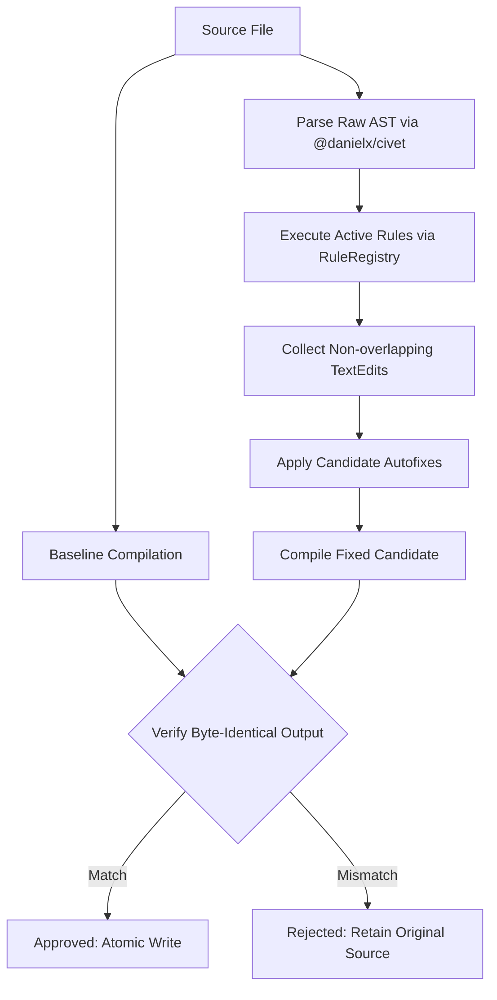

# civet-clint

[](https://github.com/shogi-dojo/civet-clint/actions/workflows/ci.yml)
[](https://www.npmjs.com/package/civet-clint)
[](https://opensource.org/licenses/MIT)

**civet-clint** is a compiler-backed style checker and autofixer for [Civet](https://civet.dev). The package installs the concise `clint` command line tool and provides a programmatic Node.js API.

Unlike a text-only regex formatter, `civet-clint` uses the official `@danielx/civet` compiler parser. Every autofix edit is compiled and re-verified: changes are applied only when the compiled JavaScript/TypeScript output is byte-for-byte identical to the original output. This provides a behavior-preservation safety guard against accidental semantic breakage.

> **Release Status:** Alpha, published under npm's `next` dist-tag. The tool targets `@danielx/civet` 0.11.15.

---

## Features

- 🛡️ **Compiler-Equivalence Verification**: Every rule batch is verified against Civet's compilation output. Unsafe or output-altering edits are rejected by the safety gate.
- ⚡ **Atomic File Rewrites**: Changes are written atomically via temporary files, preventing partial writes and preserving line endings (`\n` vs `\r\n`).
- 🎯 **Ranked & Coffee-React Style Rules**: 16 built-in rules covering word operators, concise arrows, bare bindings, JSX shorthand, and idiomatic syntax.
- 🧩 **Modular Rule Registry & Plugins**: Modular `RuleRegistry` abstraction with plugin contracts, duplicate-rule validation, and runtime-isolated registries.
- 🗂️ **Per-File Configuration Overrides**: Support for glob-based `overrides` in configuration files to tailor rules, presets, and compiler dials per directory or file pattern.
- ⚙️ **Configurable & Extensible**: Support for presets (`default`, `coffee-react`), granular rule severities (`off`, `warn`, `error`), and integration with project `civet.json` configs.
- 🧭 **Dial-Aware Capability Checks**: Rules declare the compiler options they require (e.g., `autoLet`, `react`, `coffeeRange`). Incompatible rules are skipped rather than emitting invalid autofixes.
- 📊 **Flexible CLI**: Rich terminal diagnostics, `--check` exit codes for CI, `--write` in-place fixing, machine-readable `--format json`, and `clint --print-config [file]` for inspecting workspace and per-file resolved configurations.

---

## Installation

```bash
# Install the alpha release from npm (@next tag)
npm install --save-dev civet-clint@next

# Or with yarn
yarn add -D civet-clint@next

# Or with pnpm
pnpm add -D civet-clint@next
```

---

## CLI Usage

```bash
# Check all .civet files in the current workspace (default: --check)
npx clint

# Check specific files or folders
npx clint src/ components/ app.civet

# Automatically fix all safe style violations in place
npx clint --write

# Specify custom configuration file
npx clint --write --config ./civet-clint.config.json

# Output diagnostics in JSON format for CI/CD pipelines
npx clint --check --format json

# Print resolved workspace configuration and compiler dial
npx clint --print-config

# Print effective resolved configuration for a specific file (including overrides)
npx clint --print-config src/components/Button.civet
```

### CLI Flags

| Flag | Description |
|---|---|
| `--check` | Lint files and report diagnostics. Exits with code `1` if errors are found, `0` if clean. (Default) |
| `-w`, `--write`, `--fix` | Apply autofixes to source files in place after verifying compiler equivalence. |
| `--print-config [file]` | Print the resolved preset, compiler options, rules, and skipped/incompatible rules as JSON, then exit. If a target file is passed, resolves matching per-file overrides. |
| `-c`, `--config <path>` | Path to a `civet-clint.config.json` configuration file. |
| `-f`, `--format <text\|json>` | Output format: human-readable `text` (default) or `json`. |
| `-v`, `--version` | Print `clint` version and exit. |
| `-h`, `--help` | Show CLI usage help. |

---

## Configuration

Create a `civet-clint.config.json`, `.civet-clintrc.json`, or `.civet-clint.json` file in your repository root:

```json
{
  "preset": "coffee-react",
  "civetConfig": "./civet.json",
  "rules": {
    "style/prefer-word-operators": "error",
    "style/prefer-concise-arrow": "error",
    "style/prefer-bare-assignment": "error",
    "style/no-null-equality": "warn",
    "style/no-is-not": "warn",
    "style/no-trailing-semicolons": "error"
  },
  "overrides": [
    {
      "files": ["test/**/*.civet", "**/*.test.civet"],
      "rules": {
        "style/prefer-word-operators": "off"
      }
    },
    {
      "files": ["src/legacy/**/*.civet"],
      "civetOptions": {
        "coffeeEq": true
      }
    }
  ]
}
```

### Presets

#### `default`
The baseline neutral preset that relies on Civet's standard word-operator parsing without enforcing specific framework or dialect styles:
- `style/prefer-word-operators`: `"error"` (fixable)
- `style/prefer-concise-arrow`: `"error"` (fixable)
- `style/no-mixed-interpolation`: `"warn"` (diagnostic)
- `style/no-trailing-semicolons`: `"error"` (diagnostic)
- Compiler options: `{}`

#### `coffee-react`
Tailored for idiomatic Civet + React codebases (such as the Ranked style guide):
- `style/prefer-word-operators`: `"error"` (fixable)
- `style/prefer-concise-arrow`: `"error"` (fixable)
- `style/prefer-jsx-shorthand`: `"error"` (fixable, requires `react`)
- `style/prefer-bare-assignment`: `"error"` (fixable, requires `autoLet`)
- `style/no-trailing-semicolons`: `"error"` (diagnostic)
- `style/prefer-existential-check`: `"error"` (diagnostic)
- `style/prefer-jsx-attr-shorthand`: `"error"` (diagnostic, requires `react`)
- `style/prefer-ampersand-shorthand`: `"error"` (diagnostic)
- `style/no-single-param-arrow-without-parens`: `"error"` (diagnostic)
- `style/prefer-named-export-default`: `"warn"` (diagnostic)
- `style/no-thin-arrow`: `"error"` (diagnostic)
- `style/no-pipe-operator`: `"error"` (diagnostic)
- `style/prefer-range-operator`: `"error"` (diagnostic, requires `coffeeRange`)
- `style/no-null-equality`: `"warn"` (diagnostic)
- `style/no-is-not`: `"warn"` (diagnostic)
- `style/no-mixed-interpolation`: `"warn"` (diagnostic)
- Compiler options: `{ "autoLet": true, "coffeeIsnt": true, "coffeeRange": true, "react": true }`

### Per-file Configuration Overrides

The `overrides` array allows configuring rules, presets, compiler options, or separate `civet.json` configurations for subsets of files matching glob patterns. Overrides apply in declaration order on top of the base configuration.

```json
{
  "overrides": [
    {
      "files": "src/components/**/*.civet",
      "civetOptions": { "react": true },
      "rules": {
        "style/prefer-jsx-shorthand": "error",
        "style/prefer-jsx-attr-shorthand": "error"
      }
    }
  ]
}
```

### Compiler Dial & Rule Capabilities

Rules declare required compiler options (e.g., `autoLet`, `react`, `coffeeRange`) via `meta.capabilities`. When the active dial does not enable a rule's requirements, the rule is **automatically skipped** rather than executing and emitting diagnostics or fixes that are invalid under the active dial.

---

## Rules Catalog

`civet-clint` currently provides 16 built-in style and correctness rules.

### Fixable Rules

| Rule ID | Description | Required Dial |
|---|---|---|
| [`style/prefer-word-operators`](src/rules/prefer-word-operators.civet) | Convert `===`, `!==`, `&&`, `||`, `!` to `is`, `isnt`, `and`, `or`, `not`. | — |
| [`style/prefer-concise-arrow`](src/rules/prefer-concise-arrow.civet) | Convert parameterless `() =>` to concise `=>`. | — |
| [`style/prefer-jsx-shorthand`](src/rules/prefer-jsx-shorthand.civet) | Convert `className="btn"` and `id="main"` to `.btn` and `#main` shorthands. | `react` |
| [`style/prefer-bare-assignment`](src/rules/prefer-bare-assignment.civet) | Prefer bare `x = 1` for `let` and `:=` for `CONST_CASE` bindings. | `autoLet` |

### Diagnostic Rules

| Rule ID | Description | Required Dial |
|---|---|---|
| [`style/no-trailing-semicolons`](src/rules/no-trailing-semicolons.civet) | Disallow unnecessary trailing semicolons at statement ends. | — |
| [`style/prefer-existential-check`](src/rules/prefer-existential-check.civet) | Prefer existential postfix (`x?`, `not x?`) over null equality comparisons. | — |
| [`style/prefer-jsx-attr-shorthand`](src/rules/prefer-jsx-attr-shorthand.civet) | Prefer `{prop}` for `prop={prop}` and `prop` for `prop={true}`. | `react` |
| [`style/prefer-ampersand-shorthand`](src/rules/prefer-ampersand-shorthand.civet) | Prefer `&` block shorthand for single-parameter callbacks (`.map &.id`). | — |
| [`style/no-single-param-arrow-without-parens`](src/rules/no-single-param-arrow-without-parens.civet) | Require parentheses around single arrow function parameters `(x) => ...`. | — |
| [`style/prefer-named-export-default`](src/rules/prefer-named-export-default.civet) | Prefer named default exports (`export default MyComp = ...`). | — |
| [`style/no-thin-arrow`](src/rules/no-thin-arrow.civet) | Disallow thin arrows `->` in favor of fat arrows `=>`. | — |
| [`style/no-pipe-operator`](src/rules/no-pipe-operator.civet) | Disallow pipe operator `\|>`. | — |
| [`style/prefer-range-operator`](src/rules/prefer-range-operator.civet) | Prefer `[0...N].map` range loops over `Array.from({ length: N }, ...)`. | `coffeeRange` |
| [`style/no-null-equality`](src/rules/no-null-equality.civet) | Disallow direct comparisons with `null`. | — |
| [`style/no-is-not`](src/rules/no-is-not.civet) | Disallow `is not` in favor of `isnt`. | `coffeeIsnt` or `coffeeNot` |
| [`style/no-mixed-interpolation`](src/rules/no-mixed-interpolation.civet) | Disallow mixing `${...}` and `#{...}` within the same file. | — |

---

## Programmatic API & Plugins

`civet-clint` exports a typed ESM API:

```typescript
import {
  lintSource,
  lintFile,
  loadConfig,
  resolveConfigForFile,
  RuleRegistry,
  createDefaultRuleRegistry
} from 'civet-clint';

const registry = createDefaultRuleRegistry();
registry.register({
  id: 'custom/no-debugger',
  meta: {
    description: 'Disallow debugger statements',
    fixable: false,
    defaultSeverity: 'error'
  },
  check(context) {
    if (context.source.includes('debugger')) {
      context.report({
        ruleId: 'custom/no-debugger',
        message: 'Avoid debugger statements in production code'
      });
    }
  }
});

const config = loadConfig();
const result = lintSource('fn := () => a === b', {
  config,
  registry,
  fix: true
});

console.log(result.isEquivalencePreserved); // true
console.log(result.fixedSource);            // "fn := => a is b"
```

---

## Architecture & Equivalence Engine



For design details regarding AST constraints, compiler dials, and upstream Civet integration, see [docs/upstream.md](docs/upstream.md).

---

## Releasing

For release policies, SemVer tagging, and npm publishing guidelines, see [docs/releasing.md](docs/releasing.md).

---

## License

MIT © [shogi-dojo](https://github.com/shogi-dojo)
